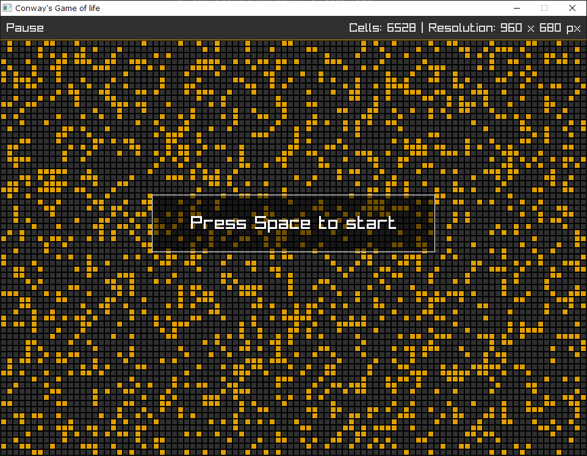
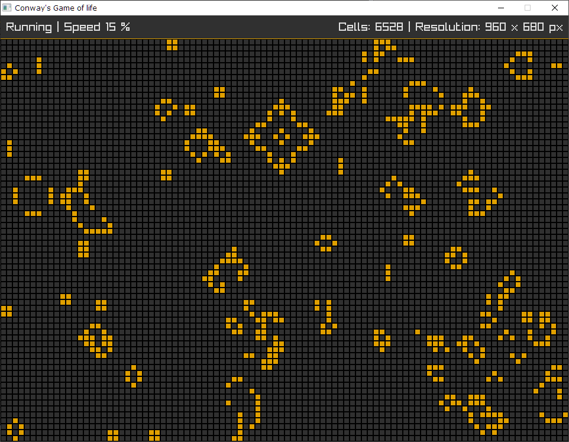
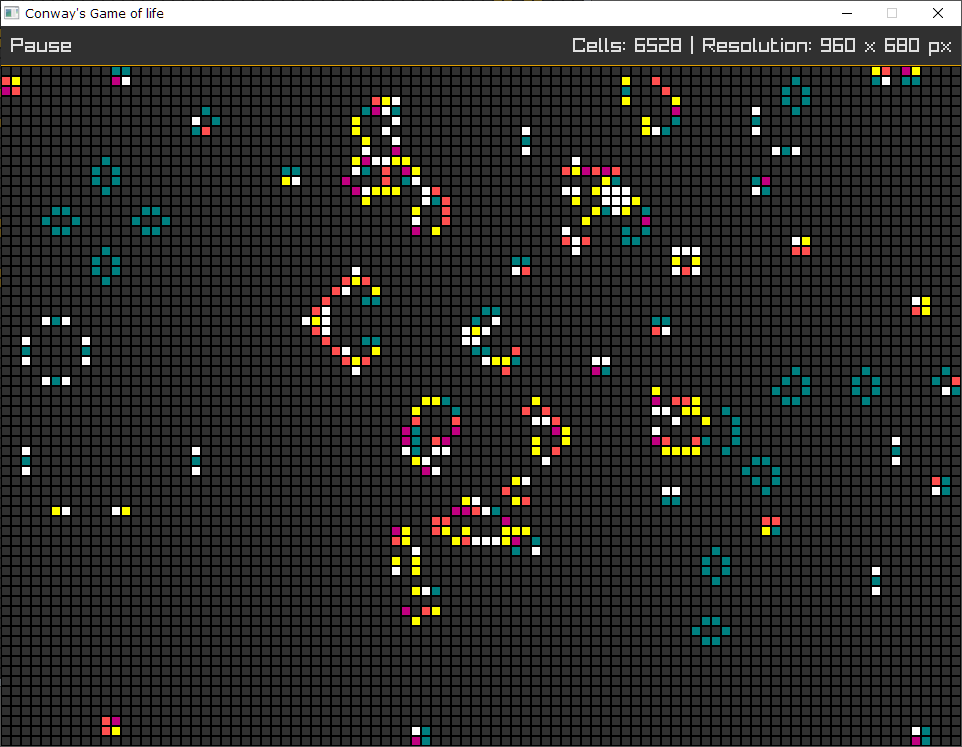

# Conway's Game of life (C + [RayLib](https://www.raylib.com/))
[Rules and description](https://en.wikipedia.org/wiki/Conway%27s_Game_of_Life)

## Keyboard shortcuts
| Key                   | Action
|:----------------------|:------
|`Esc or Q`             | Exit
|`Space`                | Play / Pause
|`C`                    | Switch between monochrome and color mode (The color of the cell depends on cell age)
|`R`                    | Reset
|`N`                    | Move one step forward while paused
|`F`                    | Toggle fullscreen
|`Mouse wheel`          | Increase / Decrease speed

## Screenshots

 

 

> In color mode, the color of the cell depends on cell's age